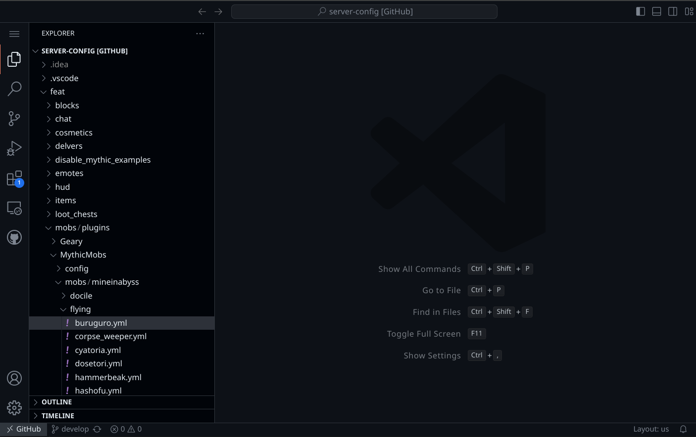
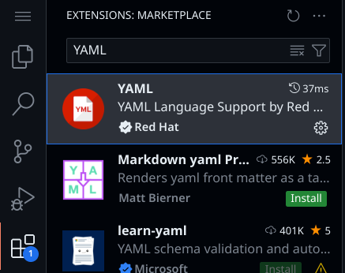
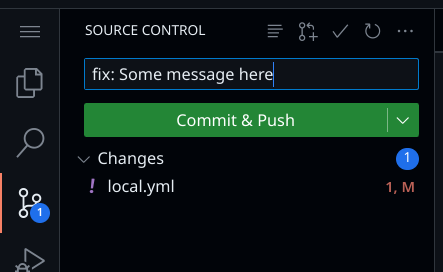

# Introduction

Our server configs are publicly visible on GitHub [here](https://github.com/MineInAbyss/server-config/tree/develop). This guide will explain the structure we use for our configs and how to edit them in your browser. Further pages will explain the syntax for different plugins we use.

## Editing configs on the web

GitHub has a web editor built in which makes editing configs much easier. Create a GitHub account and sign in.
Next, visit the [server config page](https://github.com/MineInAbyss/server-config/tree/develop) and press `.` to open the editor:

/// caption
Example showing the GitHub web editor
///

/// caption
Download the YAML extension from the left sidebar to get helpful code completion for the config files!
///

## File structure

Most server configs are stored in the `feat` folder, these are split into separate features which different servers can choose to include, as defined in `keepup/configs.yml`. This means multiple features can dynamically put configs into the same folders, for example `feat/mobs` defines MythicMobs config files, but so does `feat/pets`, on startup both will have their configs combined the same folder.

## Uploading your changes

/// caption
On the bottom left of your editor, you'll see the current branch you're working on, in this case `develop`.
///

You may click on it to create your own branch to work on changes (GitHub will ask if you want to "fork" this repo because you don't have permission to push to it directly, click yes and a copy will be made on your account).

Whenever you start working on something, we recommend swapping back to the `develop` branch, clicking the sync icon next to it to get the latest changes, and then creating a new branch for your work, ex. `fix-mob-spawning`.

The changes you make in your browser aren't automatically uploaded. To do so you need to "commit" them. Click on the source control button to the left and type a meaningful message describing what you changed.

///caption
Click `Commit & Push` to upload the changes to your branch.
///

## Getting your changes on the server

You can make as many commits as you like, just try to keep messages meaningful. Once you're done, you can click the  :octicons-git-pull-request-16: icon near the top of the previous image to create a "Pull request".

///caption
Enter a title and description and choose what "base" branch you're requesting to place your changes into, this should almost always be `MineInAbyss/develop`
///

After making a pull request, you'll be able to see it back on the server config GitHub page, someone will review it and potentially leave comments, and you can continue to commit to the branch the request was made on to update the PR. Eventually it will get "merged" into the develop branch and your changes will be live on the development server, ready for the next major update.
